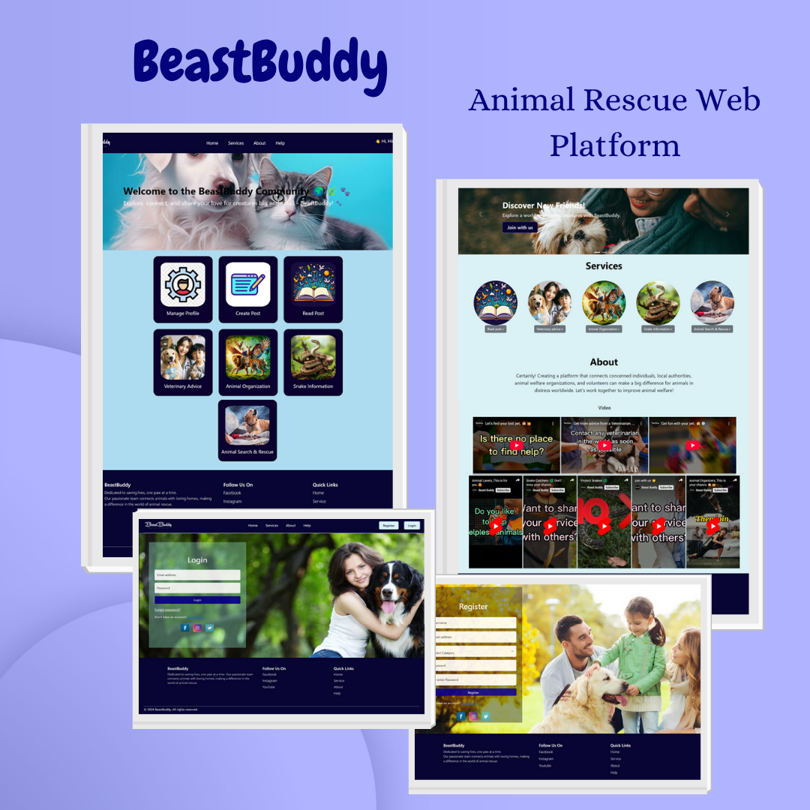

# 🐾 BeastBuddy Animal Rescue Web Platform

  

BeastBuddy is an online platform designed to connect animal lovers, veterinarians, snake catchers, and animal welfare organizations. This platform serves as a collaborative space where users can register, share posts, comment (with or without an account), and manage their profiles based on their roles.

---

## 🛠️ Technologies Used

- **Frontend**: HTML, CSS, JavaScript,Bootstrap
- **Backend**: PHP  
- **Database**: MySQL  
- **Email Service**: PHPMailer

---

## ✨ Features

- 🔐 **User Registration & Login**  
  Users can sign up and log in based on their role (veterinarian, animal lover, snake catcher, organization, etc.).

- 🗣️ **Posting & Sharing**  
  Registered users can create posts, edit or delete their own posts, and view others' posts.

- 💬 **Commenting System**  
  - Registered users can comment on posts.  
  - Guest commenting is enabled for non-logged-in users.

- 👤 **Role-Based Profile Management**  
  Users can manage their profiles and access features relevant to their role.

- 📬 **Email Integration**  
  PHPMailer is used for sending notifications and confirmations via email.

